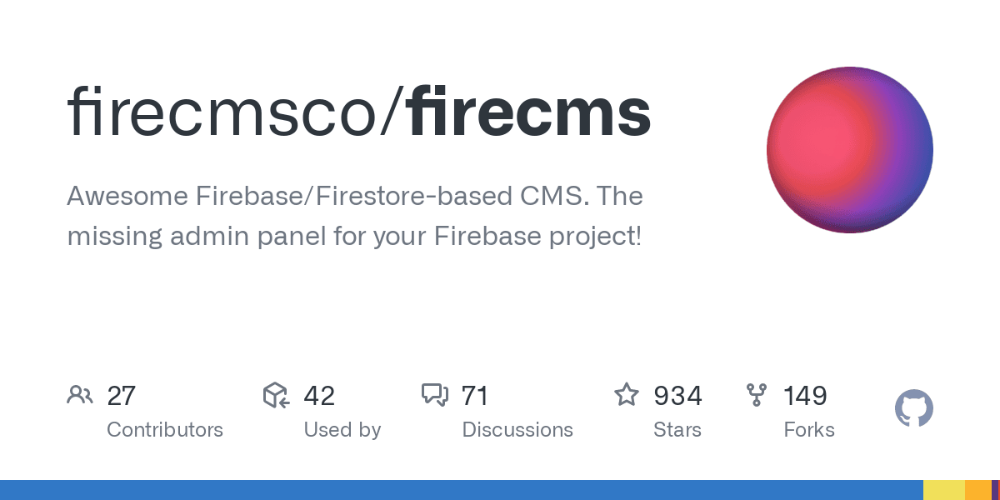
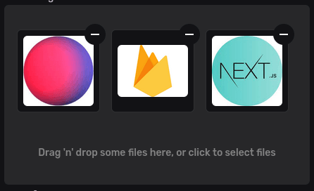

# FireStack

## My new webdesign tech stack

I've been working on a new architecture for my web development built around Firebase. I'm using NextJS for my frontend, and FireCMS backed by Firebase for the backend.

This new setup allows me to create complex blog articles easily within FireCMS, and have their content automatically uploaded to Firebase.

The frontend portion of the site is hosted on the same Firebase project as the CMS, so it can easily tap into Firestore and cloud storage to access my managed content.

I can define custom data schema's for my content too. For instance, my blogs can contain text, images, and quote. Just for good measure, here is a block quote:

> FireStack is the best setup for a 2023 website. - David A Six

Keep an eye on my site for future updates, and thanks for reading!