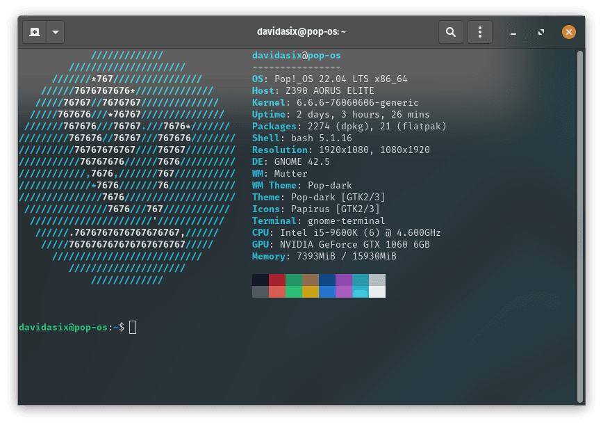

# It's time for private OS's

## 2024 is the year to start walking the walk when it comes to my privacy beliefs.

For many years I worked solely on linux. In fact my first "real" website I had planned to create a free-ware tutorial site. A desire to support and use FOSS was instilled in me a long time ago. Unfortunately through my adolescence I was seduced by the simplicity of windows, and not having to spend 3 hours debugging each time I tried a new piece of software. This sadly came at the cost of privacy, and with the rise of smart phones and homes, I think it's high time to pick up the mantle again and convert my devices to operating systems that don't spy on me.

# Desktop

I ran Windows 10 for many years so that I would have compatibility with Excel, Adobe, and many games. Unfortunately Windows 10 going EOL is just around the corner, and Microsoft seems to have double down on decaying their platform in an effort to make more money. To avoid having to switch (and having to use an increasingly unsafe Windows 10 after final update) I've opted to switch back to Linux.

I've run many Ubuntu, Mint, AV, and PI repos over the years. Ubuntu seemed the obvious choice, but I had heard rumblings around **Pop OS.** I decided to give POP a go, and booted it up onto my PC. After juggling my hard drives  for a few days (I still had business to conduct) I was able to fully make the switch.

## The Great

After the initial set up, I've really enjoyed being back on Linux. Pop runs Gnome, which has allowed me to customize my desktop just how I wanted it. Also the productivity tools in Pop are great. I particularly like Tiled Windows, which has been an amazing drop in replacement for Fancy Zones on PowerTools, Windows. 

## The Mediocre

I run a PCSX2 Emulator on one of my shared hard drives to play Rachet & Clank, Going Commando (a childhood favourite). The emulator worked incredibly on Windows, with perfect frame rate, and the ability to increase the FPS by 5000%. On Linux however the emulator is struggling to maintain 60FPS on the 20 year old game.

## The Not so Great

Cyberpunk 2077, one of my favourite games, does not work. I've spent hours troubleshooting, but unfortunately the dark future cannot come to my new build. I purchased the game on GOG to support CDPR better, and to avoid DRM. Unfortunately that decision has come back to bite me, as the Steam version works on Proton, and the GOG version via Lutris works on nothing. Hopefully this gets resolved as [clearly I'm not the only one](https://www.gog.com/wishlist/games/cyberpunk_2077_on_linux), but only time will tell.

# Phone

I've got a Pixel 7. While I **do** like all of the fancy Google features in it, it's obviously a travesty when it comes to privacy. Letting Google (or any company) know things about me that I don't want to share disagrees with me. To that end, I've installed GrapheneOS.

Naturally as I'm on Linux now I had some trouble getting it install, but eventually prevailed. I love the Google Sandbox setup, and now I don't think I could have a phone without a "Network Access" permission setting. So far, I'm very impressed.

# Privacy is a process

Making your digital life more private is a lifelong journey, and everyone's approach can be different depending on their risk tolerance. My threat profile is not as restrictive as others, so I still indulge in some less than private practices, but these OS switches are a great change.

I've still got devices to update and changes to implement, but it's great to see this progress. Privacy is a process, and I've got it in progress.