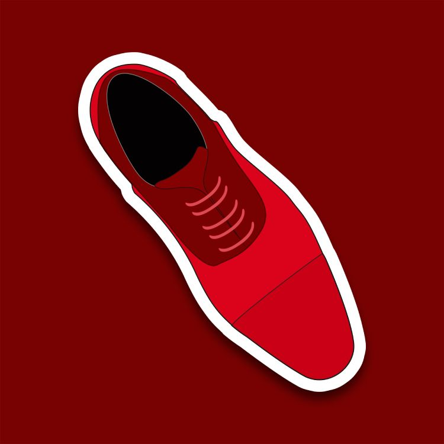

# New Logo Design

I am trying to design a logo for my website and personal brand.

I feel the obvious choice is my bright red oxford shoes, as they have been my personal brand for years and are already recognizably **David**

Using Photoshop I made a vector design of my shoes from a photo I had of them. The vector looks really good (I should see about adding the ability to post photos to this blog soon) but when it is converted to monochromatic the shoes just look like two blobs. To give the logo a recognizable shape when monochrome I added in my circular OutSun design (see non attached photo #2 - I really need to add that functionality) around the shoes.

To give some idea, OutSun is a solid colored circle line drawn with 6 solid circles along the circumference. It's got 2 slices out of it at 4 of the circumference circles, creating 2 separate sections with 6 circles on them.

I had originally used this design to encircle an OutRun style sun which was place-holding my websites front page. I was also quite interested in viruses at that time, so when you clicked this sun it would open a vibrating mini window that read "Nervous Window". Open enough of these and chrome would crash. It was inspired by the **You Are an Idiot** JS virus

I digress. The logo is coming along.

My girlfriend suggested I use 8BitDave from the front page, but I think I'd prefer something a bit cleaner for a logo representing my personal brand.