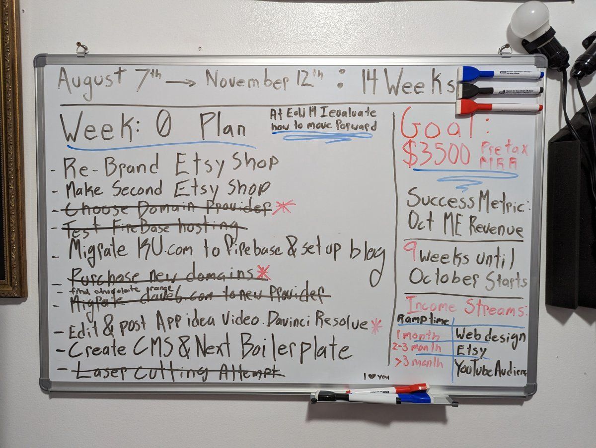

# Stepping out of the 9 - 5, Week 0

## FireStack Prepping

Well I've left my comfortable corporate position at Rogers in pursuit of loftier goals. On July 21st I effectively resigned from Rogers Communications, taking a package that would allow me to cover my bills comfortably for a few months. I plan on using this time to work for myself, and what better way to start a plan than writing out a plan. After a week of relaxing and housework, I bought a whiteboard and started to plan out my next few months.

I've decided that I will re-evaluate my success running a business for self after 14 weeks, as that should give me an indication of what I've accomplished; If I haven't accomplished enough, it also allots me time to find a new corporate job.

This week was Week 0 of my plan. I largely used this week to plan out the tech stack for my web design business, and I think I succeeded at that. I am writing this blog post via FireCMS, the backend headless CMS that will manage my web design content.

In addition to sorting out my stack, I managed to migrate all of my domains and most of my existing services over to new providers, which cuts down on my costs and simplifies my workflow.

**Week 0 Goals:**
- Re-Brand Etsy Shop 
- Make Second Etsy Shop 
- Choose Domain Provider 
- Test Firebase Hosting 
- Migrate KU to Firebase 
- Purchase new domains 
- Migrate Dave6.com 
- Edit & Post App Idea Video 
- Create CMS & Next Boilerplate 
- Laser Cutting Attempt

While I didn't manage to complete all of my goals, I put a good chunk into them, and was able to move some over to next week.

It's been a great start, and I think if I keep up this pace I can continue to be happily unemployed in the future!

Check back next week to see if I keep up this sunny disposition.