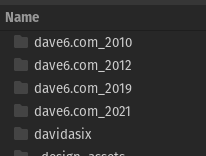
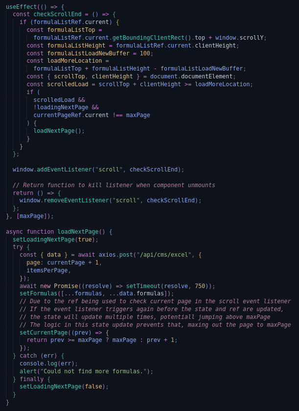

DavidASix.com is my personal portfolio website, and it has gone through many iterations over  the years. I've been writing and re-writing my personal space online for over 14 years, and I'm sure this current iteration will change sometime in the future.

Previously my site was named dave6.com, as I was gifted the domain from my father. With his encouragement I was introduced to web development, starting out with a simple HTML website. Through the years my site has evolved, spending a long while as a PHP site backed by MySQL, all the way to its current build as a NextJS site, backed by StrapiCMS running on a Digital Ocean droplet.

## Concept

This site is meant to house my projects and portfolio, but also to serve as a portfolio piece. The site displays my ability to design multiple layouts, multiple content loading systems, and implement clear clean API routes to handle content delivery

### Layouts

**Bento Box **- The homepage sports a Bento Box layout, built with CSS grid. I implemented glass morphisim over an animated gradient, as well as a group focus effect for each element when hovered

**Aside Information** - The Excel page contains an aside design, with some summary information in a sticky content box to the right, and the main scroll-able content on the left

**Classic List **- The Blog page contains a classic content list, with a single item per row. The list items are served in chronological order.

**Section List** - The Projects page contains a sectioned content list. It lists all of my projects, broken up by their category. The categories and projects are both sorted by chronological order of most recent project.

### Content Loading Systems

**Button Loader** - the Blog page contains a button loader. The user must click a *Load More *button to have more content load in.

**Pre-fetch Loader **- The Projects page preloads all content, and has no option to load more. This is done as the projects will be less frequently updated, and has a lower potential for lots of content to be added.

**Infinite Scroll Loader **- The Excel page contains an infinite scroll loader. Once the user reaches the end of the page, a skeleton component is shown and more content is collected from the server.

