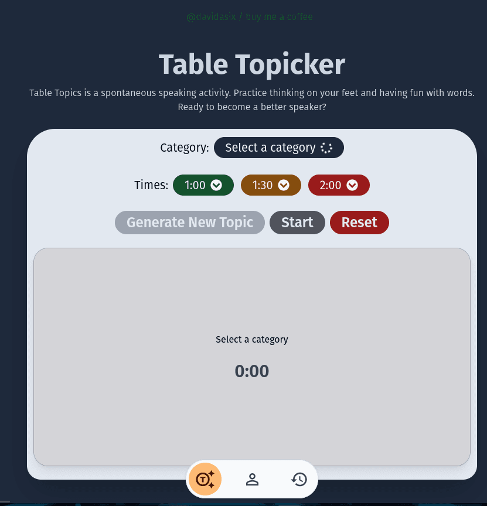
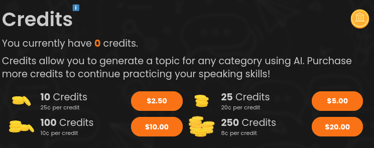
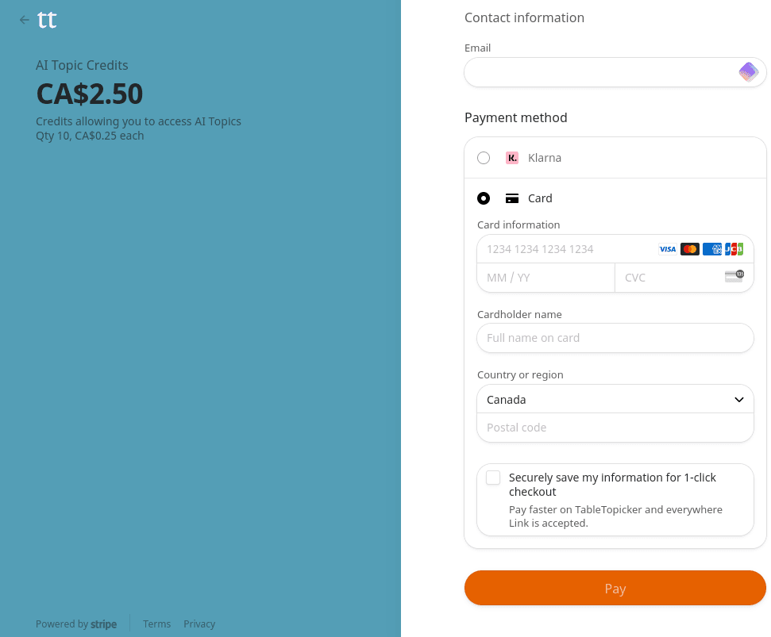

Table Topics is an [impromtu speaking exercise](https://www.toastmasters.org/Membership/Club-Meeting-Roles/Table-Topics-Speaker) practiced by Toastmasters where you are given a topic and within a few seconds you must start giving a speech on that topic. The length of the speech ranges depending on the Toastmasters club, but generally the are expected to be either one minute or two minutes long.

My friend (who is a fellow Toastmaster) and I would practice table topics together between meetings, but we ran into the problem of coming up with new interesting topics to discuss. This problem became the idea for my first version of TableTopicker, a web app to help you practice your table topics.

## Initial Build

The first version of the app was simply backed by a MongoDB database with a few hundred questions broken down by category. Users could roll for a random question, then time themselves as they performed a speech.

## Scaling Up

As my friend and I used the app more I decided that the project would benefit from introducing some more features. I also decided to use this as an opportunity to practice building a SaaS product by integrating paid features with Stripe. 

### Authentication

While using NextAuth was an option I opted to build a "Magic Link" email authentication system from scratch. I wrote extensive Auth logic, utilizing JSON Web Tokens and MailGun API for email delivery. After a user receives and opens the magic link, the JWT is saved as a cookie and sent with any future requests. If the user logs out, their JWT is blacklisted on the server.

### Paid Features

For paid features, I decided to include AI generated topics so that users could perform table topics related to upcoming meeting themes, and complete endless topics about their favorite themes. I achieved this by implementing the OpenAI GPT 3.5Turbo model in a multi-shot API request. The request contains a conversation generated on the server containing a list of previously selected questions (to avoid generating repeated questions) and their corresponding requests. The model responds with two topics which are provided to the user; the user then selects their favorite, and it is stored in the database for future reference.

### Stripe Integration

I have a strong personal preference to one-time purchase lifetime or consumable purchases over reoccurring monthly payments.  While a single lifetime purchase is my overall preference, due to the nature of the OpenAI API pricing I decided on a "consumables" approach.

Once logged in, a user can go to the profile page and purchase AI credits. Each time they select an AI topic (from the two provided by thhe API) a credit is consumed. This is achieved by redirecting users to the Stripe checkout page, then capturing their checkout through a webhook. The webhook adds the credits to their account and redirects them back to the home page.

